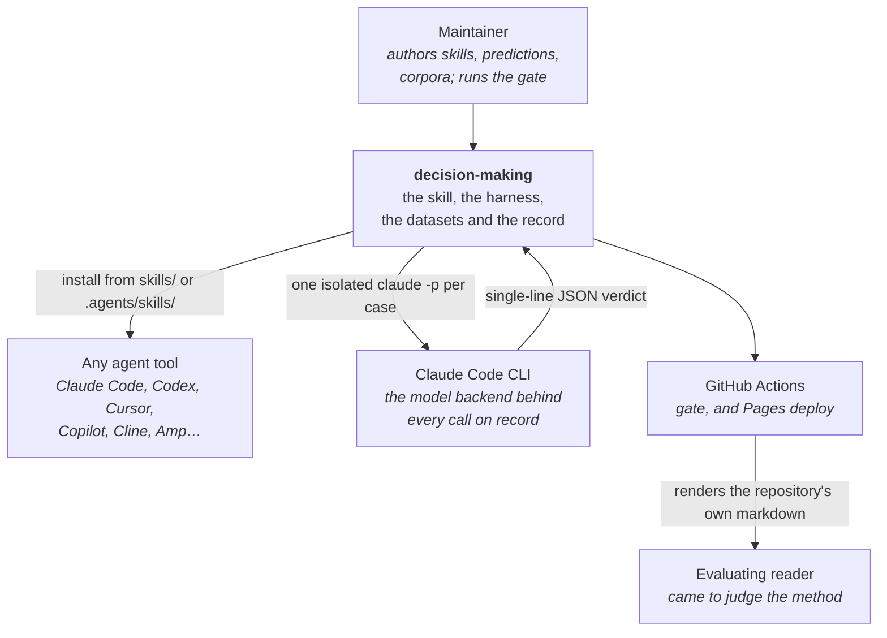
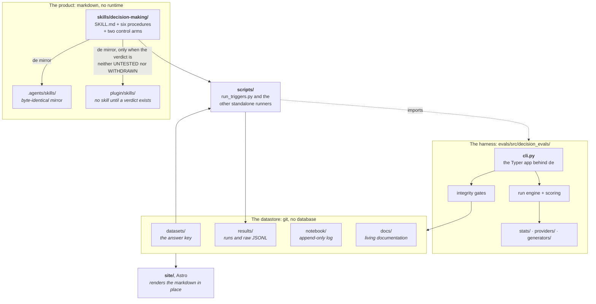
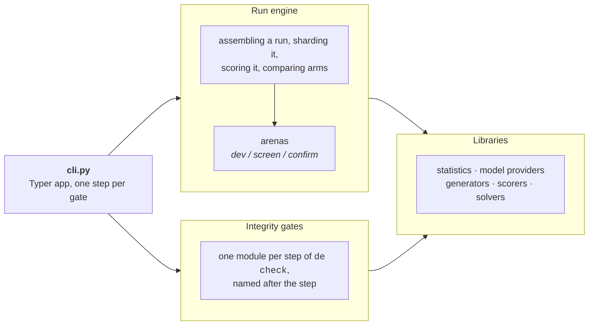
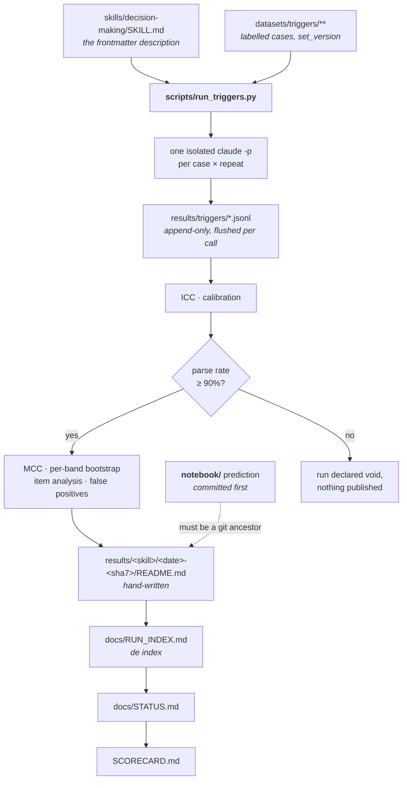
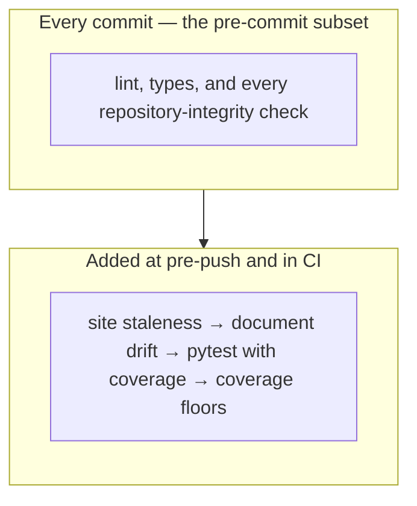
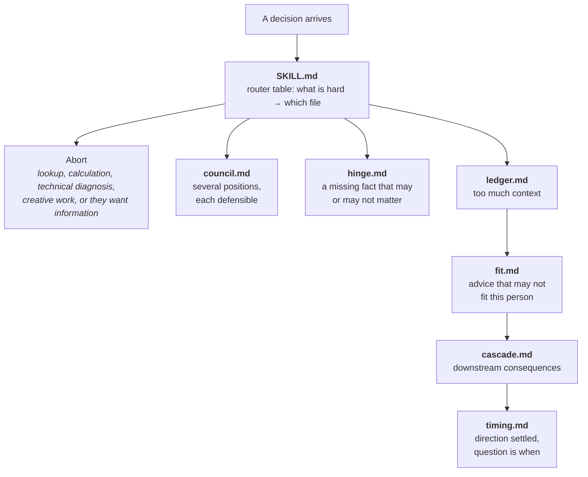

# Architecture

**Audience:** the evaluating reader.

**What this is.** How the pieces fit: what ships, what measures it, where the
data goes, and which gate stands between each step and the next. Read it before
`docs/RESEARCH_PROGRAMME.md`, which says what the experiments are and assumes
you already know what runs them.

Two things live here. `decision-making` is a skill someone installs: eight
markdown files and no runtime. `decision_evals` is the harness built to find out
whether that skill helps, and it is most of the code.

---

## The system, from outside

Every model call goes through the Claude Code CLI as a subprocess on a Claude
Max subscription. There is no API key and none may be added, which is why
`total_cost_usd` in a run record is a notional API-equivalent price: a burn
meter, and never money anybody spent.

---

## What is inside

**The product has no runtime.** `SKILL.md` and the six procedures are prose an
agent reads. Nothing in `decision_evals` executes them; the harness measures
what a model does when handed the skill's description, which is why a change to
that description makes every published number incomparable.

**The datastore is git.** YAML for corpora, JSONL for raw verdicts, markdown for
everything else. No database, so every record is diffable and every claim has a
commit behind it.

**The site copies nothing.** Astro loads the markdown from the repository
directly, so `docs/STATUS.md` is the file GitHub serves and the file the site
renders. `site/inputs.json` is where the globs are authored, and
`decision_evals.site` hashes them to decide whether a published build is older
than its inputs. `site/src/content.config.ts` restates the same globs for the
loader; a comment there is what keeps the two in step, and the two have already
drifted apart in two entries.

**The mirrors are generated because symlinks do not survive a Windows
checkout.** `de mirror` writes real copies and `de check` refuses when they
disagree.

---

## The harness, component by component

The diagram draws the shape. The inventory below is rendered from the package
itself, so it grows a row the day a module does.

<!-- de:generated harness-modules -->
| Package | Modules |
| --- | --- |
| `decision_evals/` | `adjudication` · `arenas` · `budget` · `citations` · `claims` · `cli` · `corpus` · `corrections` · `decisions` · `deployed` · `docs` · `drift` · `elicit` · `orchestrator` · `prereg` · `provenance` · `rescore` · `runner` · `sharded` · `site` · `skills` · `sync` · `tailoring` · `telemetry` · `trigger_arms` · `triggers` · `unbundle` · `wiring` |
| `decision_evals/corpora/` | `lost_in_conversation` |
| `decision_evals/generators/` | `audit` · `generate` · `loader` · `safe_eval` · `schema` |
| `decision_evals/providers/` | `antigravity` · `claude_code` · `openai_compatible` |
| `decision_evals/scorers/` | `answer` · `bfcl` |
| `decision_evals/solvers/` | `arms` |
| `decision_evals/stats/` | `agreement` · `calibration` · `cluster` · `multiplicity` · `paired` · `power` · `reliability` · `track_h` |
<!-- /de:generated -->

`trigger_arms.py` carries the part that is easiest to get wrong: scoring one
arm, comparing two, and the four guards that refuse a comparison which would be
meaningless. `label_versions_comparable` exists
because a single label move once raised recall three to five points on every arm
already on disk, with zero calls re-made.

`arenas.py` separates `dev` from `screen` from `confirm` so cheap-model
iteration cannot leak into a verdict-bearing run.

`wiring.py` refuses a module that carries a coverage floor and no path from an
entry point, because a tested refusal with no caller reports green either way.
It catches nothing today. `prereg.py` was the one declared gap: built and
tested, scoped to an arena that has never run, and reachable by nothing.
`de confirm` now imports it from the console script, so the entry left
`[tool.decision-evals.unwired]` in the same change and the register is empty.

---

## One run, end to end

This is the path behind every trigger number published so far. Two published
track-H probes did not take it: their calls were dispatched as sub-agents, so
they carry an answer key and raw readings but no checkpoint, no notional cost
and no isolation receipt, and both records say so.

**Isolation is applied by the builder, so no call site can omit it.**
`ISOLATION_FLAGS` in `providers/claude_code.py` goes into every command:
`--setting-sources ""`, `--tools ""`, `--disable-slash-commands`,
`--strict-mcp-config`, a `--mcp-config` declaring no servers, and
`--no-session-persistence`. Each call gets a throwaway working directory, and
the CLI's own init event is read back to confirm the isolation happened.

That flag list is a measured result. `--system-prompt` is documented as a full
replacement, and a canary run recorded in
[`notebook/2026-08-10-isolation-canary.md`](../notebook/2026-08-10-isolation-canary.md)
found that a `CLAUDE.md` planted in the working directory is still injected
through it. Replacing the system prompt governs a different injection path, and
`--setting-sources ""` is the flag that blocks project memory. The failure is
silent, so without it every arm would have inherited whatever `CLAUDE.md` sat
above the run, as one confound across all of them at once.

**The checkpoint is the unit of resumption**, and its path varies by arm and
corpus on purpose. A resume keyed only on case id and repeat would silently
merge two different answer keys into one file.

**The void gate reads every repeat.** Computing the parse rate on repeat 0
alone once cleared 90% while the true rate across repeats was under it. Below
the floor the run is measuring format compliance, and it stops before anything
is published.

**The prediction has to predate the data, and git proves it.** The run README
names a `notebook/` entry, and `provenance.py` refuses unless the first commit
that added that entry is an ancestor of the run's commit.

---

## The gate

`de check` makes no model calls and is deterministic. It runs in order, and the
table below is the gate's own step table.

<!-- de:generated de-check-steps -->
| # | Step | `--fast` |
| --- | --- | --- |
| 1 | git identity | runs |
| 2 | ruff check | runs |
| 3 | ruff format | runs |
| 4 | mypy | runs |
| 5 | skill lint | runs |
| 6 | trigger sets | runs |
| 7 | tailoring corpus | runs |
| 8 | plugin manifests | runs |
| 9 | citations | runs |
| 10 | run provenance | runs |
| 11 | integrity wiring | runs |
| 12 | decision register | runs |
| 13 | label corrections | runs |
| 14 | label adjudication | runs |
| 15 | checkpoint label versions | runs |
| 16 | documentation | runs |
| 17 | published claims | runs |
| 18 | generated regions | runs |
| 19 | site | skipped |
| 20 | document drift | skipped |
| 21 | pytest | skipped |
| 22 | coverage floors | skipped |
<!-- /de:generated -->

No generator is a step. `de sync`, `de mirror` and `de index` write files, and
a gate that repaired the tree while reading it would be reporting on a tree
nobody is about to commit, so each has a step that refuses the stale output
instead. Rebuilding the site is the same shape with a harder edge: it needs a
Node toolchain and a few seconds, so the refusal on a stale
`site/build-manifest.json` waits until pre-push, which is what forces you to
have run `de site`.

Two checks sit outside the gate altogether. `de fetch` verifies the hash-locked
vendor corpora against their lockfiles, and that is a network call. `de deployed`
asks the live site which commit it is serving: the one online check here, and
the only one that can answer a question a working directory cannot.

CI runs the same gate on a clean checkout with full history, which is how the
gate first learned that "the path exists" had meant "exists on the authoring
machine". A second workflow publishes the site and checks nothing. They fire
independently on the same push, so a green gate and a published site are two
separate facts; `de deployed` is what reconciles them, and exit 2 means it could
not tell.

The gate checks whether a reference resolves and stops there.
`docs/PROTOCOL.md` once described, in the present indicative, a refusal that had
never run, with every path in it correct. The standing rule that prose
describing a mechanism names its arena and its tense came out of reading that,
and the drift sweep in [`../AGENTS.md`](../AGENTS.md#standing-obligations) is
where it gets applied.

---

## The skill

Six procedures behind a router. The model reads `SKILL.md`, asks what would most
change the answer if it got it wrong, and reads **one** file.

The chain is the ordering rule, not a pipeline every decision walks. Where more
than one of `ledger`, `fit`, `cascade`, `timing` applies they run in that order,
because each supplies an input to the next. `council` and `hinge` sit outside
the chain, run alone, and run first where they apply.

Every file the skill ships beside `SKILL.md`, and whether the router names it:

<!-- de:generated skill-procedures -->
| File | Named by `SKILL.md` |
| --- | --- |
| `cascade.md` | yes |
| `council.md` | yes |
| `fit.md` | yes |
| `hinge.md` | yes |
| `ledger.md` | yes |
| `placebo-council.md` | no |
| `placebo.md` | no |
| `timing.md` | yes |
<!-- /de:generated -->

The two the router never names are control arms. `placebo.md` is token- and
structure-matched to `SKILL.md`, and `placebo-council.md` to `council.md`. Each
exists so that "the skill helped" and "any document of that length helped" are
not the same observation. Which control stands in for which body is declared in
`[tool.decision-evals.placebos]` and repeated in each file's own `matched_to`
frontmatter, and `de check` refuses the two if they disagree. They are harness
controls, and [`METHODS.md`](METHODS.md) has the arms they belong to.

Routing is prose instructions to a model, so it is a claim, and `dm-1` through
`dm-5` in the frontmatter are its falsifiable form. The verdict is `UNTESTED`.

---

## Where things are

| Path | What it holds |
|---|---|
| `skills/decision-making/` | The product. Authored here; everything else is a mirror. |
| `evals/src/decision_evals/` | The harness. `gate_steps()` in `cli.py` is the gate's step table, and each repository-integrity step lives in the module it is named after: `docs.py`, `citations.py`, `provenance.py`, `decisions.py`, `wiring.py`, `skills.py`, `sync.py`, `drift.py`. |
| `scripts/` | The runners. `run_triggers.py` is behind every trigger call on record. |
| `datasets/` | The answer key: `triggers/`, `tailoring/`, `templates/` and `golden/`, `probe/` and `library/`, hash-locked `vendor/`. |
| `results/` | Published runs, one directory each, with their raw JSONL. |
| `notebook/` | Append-only, dated. Predictions go in before runs. |
| `docs/` | The living documentation. Start at [`README.md`](README.md). |
| `paper/` | The write-up, and the `refs.bib` the citation gate reads. |
| `site/` | The Astro project that renders all of the above. |
| `tests/` | `unit/`, `integration/`, `property/`, and `golden/` for the byte-pinned generator output. |

Every command the harness answers to:

<!-- de:generated de-commands -->
| Command | What it does |
| --- | --- |
| `de check` | Run the full local gate. No model calls, fully deterministic. |
| `de confirm` | Check the pre-registration locks a confirmation run is bound to. |
| `de deployed` | Report whether the published site is a build of the current `main`. |
| `de drift` | List the documents whose subject has moved since anyone recorded reading them. |
| `de fetch` | Download the vendored corpora and verify them against their locks. |
| `de index` | Regenerate `docs/RUN_INDEX.md` from the published run records. |
| `de lint` | Validate skill frontmatter, evidence metadata, and claim coverage. |
| `de mirror` | Regenerate the cross-tool mirrors (`.agents/skills/`, `CLAUDE.md`). |
| `de power` | Print the minimum detectable effect across item counts and discordance. |
| `de rescore` | Stamp every checkpoint with its answer key, and bridge the older ones. |
| `de screen` | Run the screening instrument, forwarding every argument to its runner. |
| `de site` | Build the site and record what it was built from. |
| `de sync` | Rewrite every generated region and inline fact from its source. |
<!-- /de:generated -->

[`docs/DOCUMENTATION_MAP.md`](DOCUMENTATION_MAP.md) covers the documentation's
own structure: which files are living, which are generated, which are records,
and where a new one goes.
