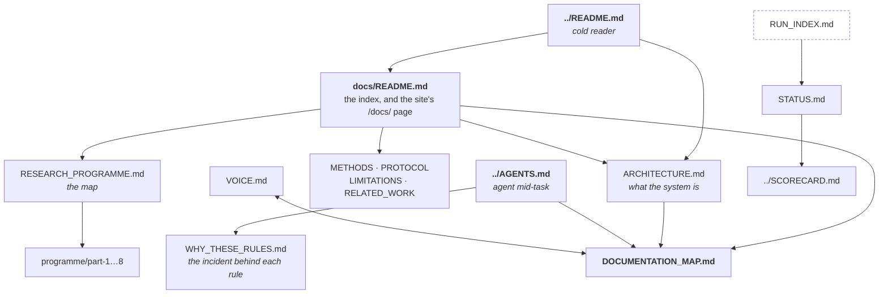
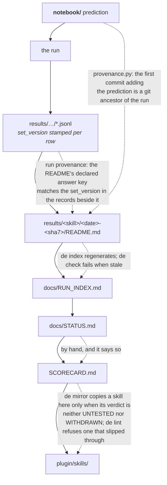

# Documentation map

**Audience:** an agent mid-task, adding or moving a document.

**What this is.** Where a new document goes, what class it belongs to, and which
gate will refuse it. [`README.md`](README.md) answers the reader's question,
which is *which document answers mine*. This answers the writer's.

[`VOICE.md`](VOICE.md) governs how the prose reads. This governs where it sits.

---

## Four audiences

Every document serves exactly one, and a document that tries to serve two serves
neither. `docs.py` refuses a living document that does not declare which.

| Audience | Where they read | What they want |
|---|---|---|
| **Cold reader** | [`../README.md`](../README.md), the site landing page, the GitHub description and topics, `CITATION.cff` | Thirty seconds to decide whether this deserves their attention |
| **Evaluating reader** | [`../SCORECARD.md`](../SCORECARD.md), [`../CONTRIBUTING.md`](../CONTRIBUTING.md), [`README.md`](README.md), [`ARCHITECTURE.md`](ARCHITECTURE.md), [`METHODS.md`](METHODS.md), [`PROTOCOL.md`](PROTOCOL.md), [`LIMITATIONS.md`](LIMITATIONS.md), [`RELATED_WORK.md`](RELATED_WORK.md), [`RESEARCH_PROGRAMME.md`](RESEARCH_PROGRAMME.md), [`posts/`](posts/what-an-eval-harness-found-about-itself.md) and the other living documents | To judge whether the method holds up |
| **Agent mid-task** | [`../AGENTS.md`](../AGENTS.md), [`../CLAUDE.md`](../CLAUDE.md), [`AUTONOMOUS_WORK_ORDER.md`](AUTONOMOUS_WORK_ORDER.md), this file | The rule that applies right now, at the lowest context cost |
| **The record** | [`../notebook/`](../notebook/), [`../results/`](../results/), [`DECISIONS.md`](DECISIONS.md), [`STATUS.md`](STATUS.md), [`RUN_INDEX.md`](RUN_INDEX.md), [`superpowers/plans/`](superpowers/plans/) | What was true on the day it was written |

Declare it in one line under the title:

```markdown
**Audience:** the evaluating reader.
```

`check_audience_lines` refuses a living document that declares no audience. It
was written because the convention on its own had not put the line on
`docs/STATUS.md`. It has no exemptions: `RUN_INDEX.md` is generated, so
`render_index` emits the line and the gate needs no register of names somebody
has to keep true.

---

## Three classes

The class decides everything else: whether you may edit it, whether a gate reads
it, and what happens when it goes stale.

```mermaid
flowchart TB
    subgraph living["<b>Living</b> — edited freely, gated by docs.py"]
        direction TB
        L1["root: README · AGENTS · CONTRIBUTING · SCORECARD"]
        L2["docs/*.md — the living documents"]
        L3["docs/programme/ — the eight parts"]
        L4["docs/reviews/ — three review briefs"]
        L5["docs/posts/ — the findings, standalone,<br/>for a reader arriving from outside"]
    end

    subgraph gen["<b>Generated</b> — never hand-edited, names its generator"]
        direction TB
        G1["CLAUDE.md ← de mirror"]
        G2[".agents/skills/ · plugin/skills/ ← de mirror"]
        G3["docs/RUN_INDEX.md ← de index"]
        G4["site/build-manifest.json ← de site"]
        G5["datasets/golden/ ← pytest --bless"]
    end

    subgraph rec["<b>Records</b> — append-only, corrected by appending"]
        direction TB
        R1["notebook/ — dated, predictions before runs"]
        R2["results/**/README.md — one per run"]
        R3["docs/DECISIONS.md — the decision register"]
        R4["docs/superpowers/plans/ — dated plans"]
    end

    living -. "a stale reference here<br/>is a defect" .-> fix["fix it"]
    gen -. "a stale file here<br/>is a failing build" .-> regen["rerun the generator"]
    rec -. "a stale reference here<br/>is correct history" .-> leave["leave it"]
```



**Living.** Edit them. Every command and path they name must resolve, the
`docs/` index must list them, and each must declare an audience.

**Generated.** Editing one by hand produces a diff the next generator run wipes,
and `de check` fails on the disagreement in between. Change the generator.

**Records.** A notebook entry naming `de report` in 2026-08-11 is correct
history, and a gate demanding an edit would destroy the evidence the whole
method rests on. Corrections are appended, never rewritten. This is why
`docs/superpowers/plans/` sits in `EXCLUDED_PREFIXES`: a plan names what somebody
intended to build, and widening the scan found 23 references in one plan that no
longer resolve, among them four plans it proposed and never wrote, a script that
was never added, and line ranges that moved the next time those files were
touched. Excluded as a class rather than as the files that happen to fail today,
because "records are checked until they age" is not a rule anybody can write
to.

---

## What a living document does not write by hand

A living document is prose written by a person, with two exceptions. Both are
HTML comments, so they are invisible on github.com and on the site, and both are
written by `de sync`.

**A table the repository can derive.** Put the markers in and run `de sync`:

````markdown
<!-- de:generated <region-id> -->
<!-- /de:generated -->
````

`REGIONS` in `decision_evals.sync` is the list of ids: the `de` subcommands, the
steps of the gate, the modules of the harness, the files the skill ships, the
arms and what each answers. Each renders from the live object itself, the Typer
app or the step table or the package directory, so a subcommand added without a
`de sync` is a red gate naming the row that is missing. `de check` also refuses
a region no renderer answers to, a renderer no document uses, and a marker that
never closes.

**A figure that has to sit inside a sentence.** `site/claims.json` pins a number
to one exact sentence in one repository file. A document states the registered
value, and `de sync` keeps it there:

````markdown
a corpus that is <!-- de:fact <claim-id> -->89%<!-- /de:fact --> solvable
````

`de check` refuses a marker naming a claim `site/claims.json` does not declare,
and a marker in the claim's own source, where `de sync` would rewrite the
sentence the anchor exists to verify. The register's own rule is unchanged: a
claim nothing publishes may not sit in it.

The ids are illustrative above and deliberately not real. A live marker in this
file would make it a publisher of a figure it is only describing.

Markers cover what the repository already knows. The rest is reading, and the
next section is when that happens.

---

## Which documents to re-read

`de drift` computes the worklist. A document's dependencies are the repository
files it names, the same paths `docs.py` extracts to prove they resolve, and
`[tool.decision-evals.reviewed]` records the commit somebody read it at. A
directory is a place and not a mechanism, so naming one is not a dependency on
it: counting them put `docs/README.md` thirteen commits behind on other
people's work inside `notebook/`, and every one of the thirteen was noise. The
report is the documents whose named paths have moved since, furthest behind
first, with the line to paste back once you have read one. `de check` refuses a
document that has gone more than ten commits past its review.

Generated documents are exempt by rule: reviewing one means reviewing its
generator, which is source.

A recorded sha is one person's claim that they read the document, and it is
worth what that person is worth. `docs/PROTOCOL.md` once described, in the
present indicative, a refusal that had never run, with every path in it correct,
and no check here would catch that today either. What the register buys is an
obligation that is visible and dated.

---

## How the documentation connects



The reachability rule found a 315-line draft procedure nothing had ever linked
to. Solid edges above are links a reader follows, and `docs.py` proves every one
of them resolves, that `docs/README.md` lists exactly the documents that exist,
and that nothing under a `docs/` subdirectory can be reached only by listing the
directory.

What no gate proves is that a description is still true. The index can say a
document answers a question it stopped answering months ago and every link will
resolve. That is a reading job, and
[the drift sweep](../AGENTS.md#standing-obligations) is when it happens.

---

## The record lifecycle

The chain a finding travels, and what binds each link.



Every link in that chain is bound by a gate except one. `docs/STATUS.md` is
written by hand and says so in its own first lines; corrections there are
appended, never rewritten.

---

## Where a new document goes

1. **Is it a record of something that happened on a date?** Then it is a
   `notebook/` entry or a `results/` README, and it is append-only from the
   moment it lands. Not a doc.

2. **Is it generated?** Then the generator is the change and the file is an
   output. Say so in its first lines and name the command.

3. **Does it belong to an existing document?** Prefer a section. Nineteen
   documents that each answer one question beat thirty that overlap, and the
   index has to stay scannable.

4. **Otherwise it is a living document in `docs/`.** It needs a title, an
   `**Audience:**` line naming one of the four, a row in
   [`README.md`](README.md), and every path and `de` command in it to resolve.

5. **If a document has outgrown one file**, split it on the headings it already
   has, into a subdirectory named for it, by exact line boundaries. Never rewrap
   during a split: the citation gate binds a claim number to its `refs.bib`
   quote by markdown **block**, so reflowing can move a number into a block whose
   identifier has no quote behind it and turn a green gate red. The map file
   keeps the navigation and the rules that apply across every part.
   `RESEARCH_PROGRAMME.md` and [`programme/`](programme/part-1-what-is-already-known.md)
   are the worked example: 2,550 lines became a map of under 500 and eight
   parts.

## What will refuse you

| Gate | Refuses |
|---|---|
| `check_command_references` | A `de <cmd>` that is not a command, unless declared in `[tool.decision-evals.docs-absent-commands]` |
| `check_path_references` | A link or backticked repo path that does not resolve, unless declared external or deliberately untracked |
| `check_component_table` | `../README.md`'s map disagreeing with the top-level directory listing |
| `check_docs_index` | [`README.md`](README.md) disagreeing with `docs/`, a subdirectory it never names, or a document nothing links to |
| `check_audience_lines` | A living document that declares no audience |
| `check_sync` | A generated region that is not what it renders from, one naming no renderer, a renderer no document uses, or a marker that does not close |
| `check_claims` | A figure a document states that the register does not declare, a claim nothing publishes, or a marker in the claim's own source |
| `check_drift` | A living document with no review on record, or one more than ten commits past it |
| `check_site_step` | A published site older than the markdown it renders, or a collection in `../site/inputs.json` missing a field one of its three readers needs |
| `check_mirrors` | `../CLAUDE.md`, `../.agents/skills/` or `../plugin/skills/` disagreeing with its source, or a plugin copy whose source verdict no longer permits shipping |

Each register a gate reads may only shrink, and each refuses twice: an entry
that stops being true is an error, and so is an entry nothing names. That is what
keeps a register from becoming the place inconvenient failures go.
